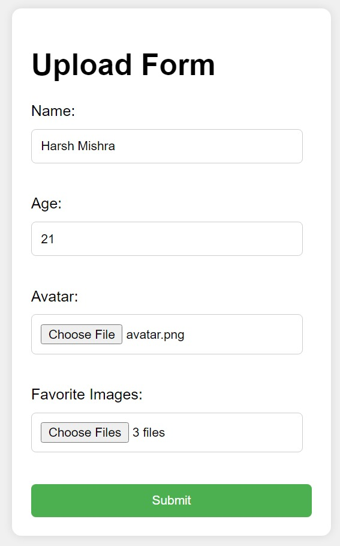

# Multipart Form Upload with Express.js and Multer

This is a simple Express.js application demonstrating how to handle multipart form data with file uploads using the Multer middleware. The application enables users to upload an avatar image and multiple favorite images through a web form.

## Prerequisites

-   Node.js installed on your machine
-   npm (Node Package Manager) installed

## Getting Started

1. Clone the repository or download the project files.
2. Open a terminal or command prompt and navigate to the project directory.
3. Install the required dependencies by running the following command:
    ```bash
    npm install
    ```
4. Start the server by running:
    ```bash
    node index.js
    ```
5. Open your web browser and visit [http://localhost:3000](http://localhost:3000) to access the upload form.

## Usage

1. Fill in the required fields: Name, Age, Avatar (single file), and Favorite Images (multiple files).
2. Click the "Submit" button to upload the form data and files to the server.
3. Check the server console for the logged details of the submitted data and uploaded files.

## Output

When the form is submitted successfully, you should see the following output in your server console:

```plaintext
Name: [Entered Name]
Age: [Entered Age]
Avatar File: [File Object]
Favorite Images Details:
[File Object 1]
[File Object 2]
...
```

## Example Output Image


